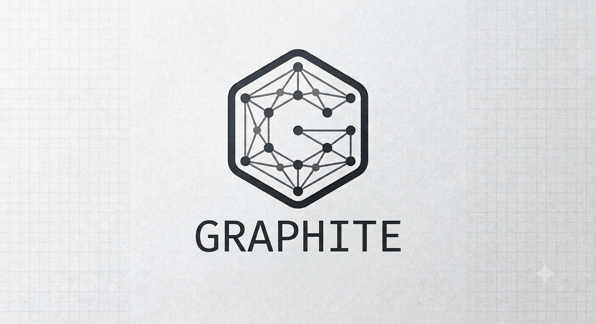

# graphite

<p align="center">
  
</p>

<p align="center">
  
  
  <a href="https://github.com/jmartinpizarro/graphite/actions/workflows/cmake-single-platform.yml">
    
  </a>

  

  <a href="https://github.com/jmartinpizarro/graphite/blob/main/LICENSE">
    
  </a>

  <a href="https://github.com/jmartinpizarro/graphite/releases">
    
</a>
</p>

Graphite is a generic programming-based library for working with and processing graphs.

> [!CAUTION]
> Do not use this library in professional projects. If you do, it's your fault, not mine :)

## Algorithms

Several algorithms have been implemented:

- DFS
- BFS
- Dijkstra
- A*
- Prim
- Kruskal
- Floyd-Warshall

## Compile and deploy

```bash
cmake -S . -B build -DCMAKE_EXPORT_COMPILE_COMMANDS=ON
cmake --build build
```

If you are developing:

```bash
ln -Sf build/compile_commands.json
```


